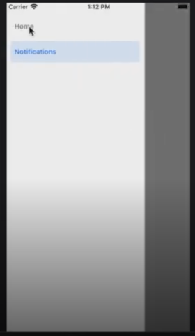
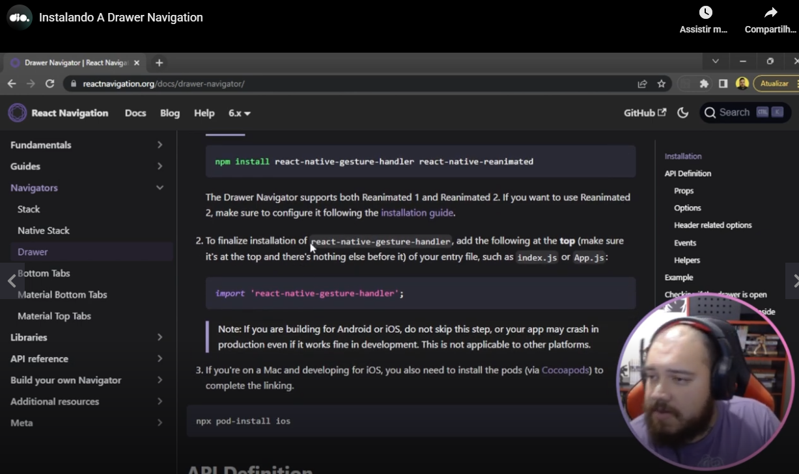
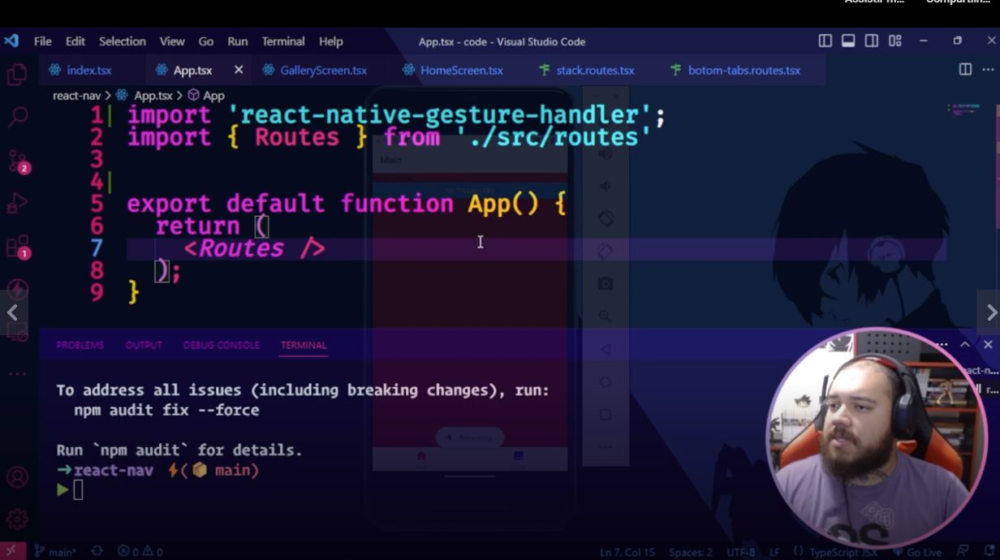
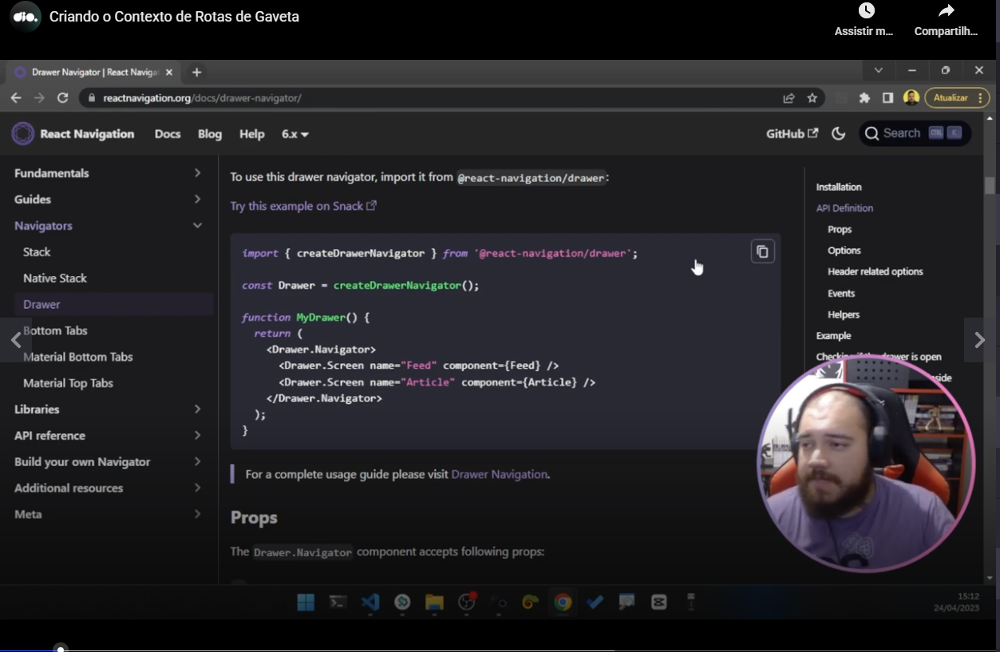
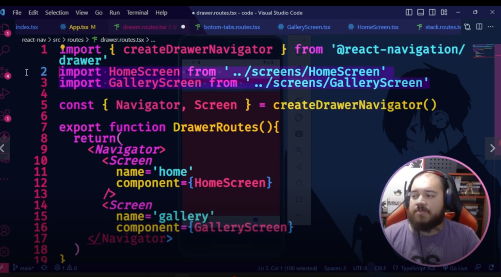
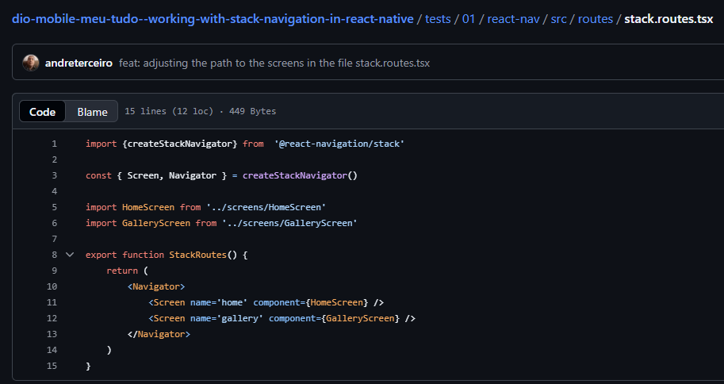
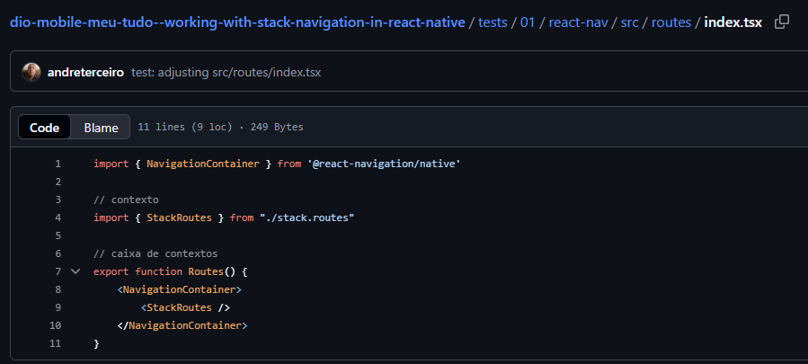
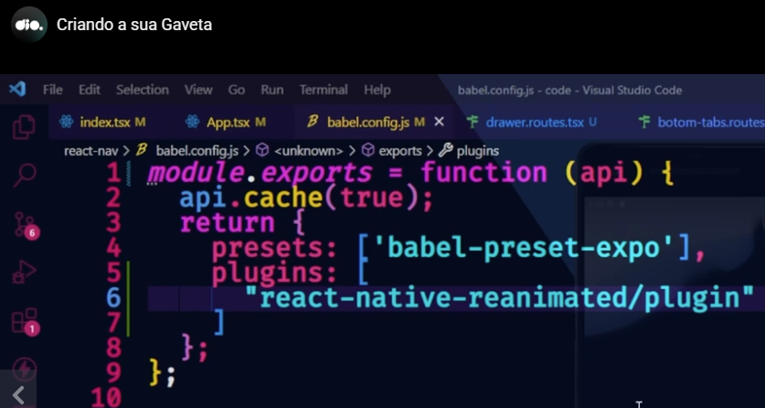

# Initial demo




# Installation

```
npm install @react-navigation/drawer
```


# Installation of extra packages

Para um projeto "Bare", sem o Expo:

In a project with Expo:
```
npx expo install react-native-gesture-handler react-native-reanimated react-native-worklets
```

In a project without Expo:
```
npm install react-native-gesture-handler react-native-reanimated react-native-worklets
```

**OBS:** in the command inserted by the teacher, he did not installled the package "react-native-worklets", but I got the command I passed above [from the updated manual](https://reactnavigation.org/docs/drawer-navigator/?framework=expo#installation)


# Finishing the installation

To finish the installation teacher said that we must do an import in index.js or App.js (in a demo project I saw only the files index.tsx and App.tsx):



Teacher did this in App.tsx:




# Creating the file routes/drawer.routes.tsx

As teacher did with other types of navigations, teacher created the file routes/drawer.routes.tsx.

Examples related to other types of navigations:

- routes/botton-tabs.routes.tsx
- routes/stack.routes.tsx


# Structuring the code to work with drawer navigation

Teacher said that we can use this code available in the documentation, but he prefers to do a little different, desestructuring a object as example:




# Summary of steps passed by the teacher

1. Install drawer;
2. With the words of the teacher, install that two libraries and import in the file App.tsx the gestures library ("react-native-gestures-handler");
3. Insert in the file babel.config.js return object: plugins: 'react-native-reanimated/plugin'.

But teacher said that we only need to follow the manual instructions.

See how he pointed to the screens in the file drawer.routes.tsx:



From [this repository](https://github.com/andreterceiro/dio-mobile-meu-tudo--working-with-stack-navigation-in-react-native) you can see how this file is similar to stack.routes.tsx:



Also, he already made the screen files. From [the repository I mentioned above](https://github.com/andreterceiro/dio-mobile-meu-tudo--working-with-stack-navigation-in-react-native) you can [access the screen files](https://github.com/andreterceiro/dio-mobile-meu-tudo--working-with-stack-navigation-in-react-native/tree/master/tests/01/react-nav/src/screens).

Now in **src/routes/index.tsx** he used the component "**DrawerRoutes**:


See in [this file](https://github.com/andreterceiro/dio-mobile-meu-tudo--working-with-stack-navigation-in-react-native/blob/master/tests/01/react-nav/src/routes/index.tsx) that this similar to what we did in the test project using stack routes.



After, in the file **babel.config.js** from the src directory, he pointed to a plugin:



In the error showed in the console before the fix he showed us that we can access a documentation link.